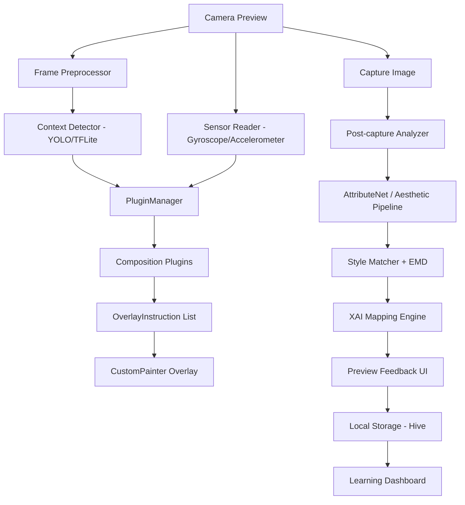

# Readme.1.md - Tổng kết Task 1.1: Infrastructure / Software Architecture Skeleton

## 1. Mục tiêu của bước 1.1

Task 1.1 có nội dung:

```text
1.1 Infrastructure / Software Architecture Skeleton
- Một khung dự án mẫu trên GitHub với các thư mục rỗng chuẩn.
- Bản vẽ kiến trúc hệ thống.
- File base_plugin.dart chứa interface chuẩn cho toàn bộ hệ thống.
- Owner: Trọng Doanh
- Deadline: 22/05/2026
```

Mục tiêu chính của bước này là dựng **khung xương kiến trúc** cho ứng dụng X-Aesthetic, không phải hoàn thiện tính năng camera, AI hay database thật. Sau bước này, các thành viên khác có thể bắt đầu code theo đúng layer, đúng interface và không bị trùng lặp trách nhiệm.

Kết quả hiện tại: **đã hoàn thành skeleton Flutter app, kiến trúc Microkernel/Plugin, tài liệu kiến trúc, tài liệu plugin contract, model dữ liệu lõi và test smoke cho PluginManager**.

---

## 2. Tổng quan repo sau khi hoàn thiện bước 1.1

Repo hiện có hai phần chính:

```text
x-aesthetic-project-main/
├── ai_training/
│   ├── models/
│   ├── scripts/
│   └── requirements.txt
│
├── x_aesthetic_app/
│   ├── lib/
│   ├── assets/
│   ├── docs/
│   ├── test/
│   ├── pubspec.yaml
│   ├── analysis_options.yaml
│   └── README.md
│
├── docs/
│   └── task_1_1_output.md
│
├── README.md
└── Readme.1.md
```

Trong đó:

| Thành phần | Vai trò |
|---|---|
| `ai_training/` | Phần Python AI research/training đã có từ base ban đầu: AttributeNet, HyperNetwork, EMD, export script. |
| `x_aesthetic_app/` | Mobile app Flutter skeleton được thêm ở bước 1.1. |
| `x_aesthetic_app/lib/core/` | Chứa các abstraction lõi: plugin, AI model object, camera object, result/common exception. |
| `x_aesthetic_app/lib/domain/` | Chứa entity nghiệp vụ như rule, style, aesthetic result. |
| `x_aesthetic_app/lib/data/` | Placeholder cho tầng database, repository implementation, data source. |
| `x_aesthetic_app/lib/presentation/` | Placeholder UI cho Camera, Preview, Dashboard. |
| `x_aesthetic_app/assets/` | Nơi chứa model `.tflite` và style config JSON. |
| `x_aesthetic_app/docs/` | Tài liệu kiến trúc và sơ đồ Mermaid. |
| `x_aesthetic_app/test/` | Test cho plugin architecture. |

---

## 3. Kiến trúc hệ thống

Ứng dụng được thiết kế theo hướng **Microkernel Architecture kết hợp Plugin Architecture**.

Ý tưởng chính:

- Phần lõi ổn định của hệ thống chỉ quản lý camera context, AI result object, plugin contract và điều phối plugin.
- Các quy tắc thẩm mỹ như Rule of Thirds, Horizon, Symmetry, Portrait Guide, Ghost Frame được triển khai thành plugin độc lập.
- Plugin có thể được thêm, tắt, bật hoặc thay đổi logic mà không cần sửa camera core hoặc UI core.
- Plugin không trả về Flutter Widget trực tiếp. Plugin chỉ trả về dữ liệu dạng `PluginOutput`, gồm overlay instruction, guidance message và metrics. UI layer sẽ chịu trách nhiệm render.

Luồng runtime tổng quát:

```text
Camera Preview
→ Frame Preprocessor
→ Context Detector / Sensor Reader
→ PluginContext
→ PluginManager
→ AestheticPlugin implementations
→ PluginOutput
→ OverlayInstruction + GuidanceMessage
→ CustomPainter Overlay / Preview UI
→ AestheticResult
→ Hive Learning Log
→ Learning Dashboard
```

Luồng này được mô tả trong file:

```text
x_aesthetic_app/docs/diagrams/system_architecture.mmd
```

Nội dung sơ đồ Mermaid hiện tại:



---

## 4. Giải thích các layer trong source code

### 4.1. `lib/app/` - App bootstrap và shell

```text
x_aesthetic_app/lib/app/
├── app.dart
└── bootstrap.dart
```

#### `bootstrap.dart`

File này là điểm khởi tạo app ở mức Flutter binding.

Class/function chính:

```dart
Future<void> bootstrap() async {
  WidgetsFlutterBinding.ensureInitialized();
  runApp(const XAestheticApp());
}
```

Vai trò:

- Đảm bảo Flutter binding được khởi tạo trước khi app chạy.
- Sau này có thể mở rộng để init Hive, load config, init camera permission, init AI engine.
- Gọi `runApp(const XAestheticApp())`.

#### `app.dart`

Class chính:

```dart
class XAestheticApp extends StatelessWidget
```

Vai trò:

- Tạo `MaterialApp` chính của hệ thống.
- Định nghĩa theme cơ bản.
- Gắn `home` là `AppShell`.

Class:

```dart
class AppShell extends StatefulWidget
```

Vai trò:

- Là shell điều hướng chính của app.
- Dùng `NavigationBar` với 3 tab:
  - `Camera`
  - `Preview`
  - `Progress`

Ba màn hình được gắn sẵn:

```dart
static const _screens = <Widget>[
  CameraScreen(),
  PreviewScreen(),
  DashboardScreen(),
];
```

Hiện tại đây chỉ là UI placeholder để kiểm tra app chạy được. Các task sau sẽ thay nội dung placeholder bằng camera thật, preview thật và dashboard thật.

---

### 4.2. `lib/core/plugin/` - Trái tim của kiến trúc Plugin

```text
x_aesthetic_app/lib/core/plugin/
├── base_plugin.dart
├── plugin_context.dart
├── plugin_output.dart
├── overlay_instruction.dart
├── guidance_message.dart
├── plugin_registry.dart
└── plugin_manager.dart
```

Đây là phần quan trọng nhất của task 1.1.

#### `base_plugin.dart`

File này định nghĩa interface chuẩn cho mọi plugin thẩm mỹ trong hệ thống.

Interface:

```dart
abstract interface class AestheticPlugin {
  String get id;
  String get name;
  String get description;
  PluginStatus get status;
  Set<PluginPhase> get supportedPhases;
  Set<String> get supportedContextLabels;
  int get priority;
  bool shouldActivate(PluginContext context);
  Future<PluginOutput> evaluate(PluginContext context);
}
```

Ý nghĩa từng thuộc tính/phương thức:

| Thành phần | Ý nghĩa |
|---|---|
| `id` | Mã định danh duy nhất của plugin, ví dụ `rule_of_thirds`, `horizon_stabilizer`. |
| `name` | Tên hiển thị của plugin. |
| `description` | Mô tả kỹ thuật hoặc mô tả ngắn về plugin. |
| `status` | Trạng thái plugin: active, inactive, experimental. |
| `supportedPhases` | Plugin chạy ở giai đoạn nào: trước khi chụp hoặc sau khi chụp. |
| `supportedContextLabels` | Các nhãn ngữ cảnh mà plugin hỗ trợ, ví dụ `person`, `landscape`, `food`. |
| `priority` | Độ ưu tiên. Plugin có số priority cao hơn được chạy trước. |
| `shouldActivate(context)` | Điều kiện quyết định plugin có được bật trong context hiện tại không. |
| `evaluate(context)` | Logic chính của plugin, trả về `PluginOutput`. |

Enum:

```dart
enum PluginStatus {
  active,
  inactive,
  experimental,
}
```

Ý nghĩa:

- `active`: plugin được PluginManager xét chạy.
- `inactive`: plugin bị tắt.
- `experimental`: plugin đang thử nghiệm, hiện chưa tự động chạy nếu PluginManager chỉ chọn active.

#### `plugin_context.dart`

File này định nghĩa input chuẩn truyền vào plugin.

Class:

```dart
class PluginContext
```

Các field chính:

| Field | Kiểu | Ý nghĩa |
|---|---|---|
| `phase` | `PluginPhase` | Giai đoạn chạy plugin: `preCapture` hoặc `postCapture`. |
| `frame` | `CameraFrame?` | Metadata frame camera hiện tại. |
| `cameraPose` | `CameraPose?` | Góc máy từ cảm biến: roll, pitch, yaw. |
| `detections` | `List<DetectionResult>` | Kết quả nhận diện từ YOLO/TFLite. |
| `attributes` | `AestheticAttributes?` | Vector thuộc tính thẩm mỹ sau khi phân tích ảnh. |
| `targetStyle` | `ReferenceStyle?` | Phong cách mục tiêu như Noir, Vibrant, Minimal. |
| `metadata` | `Map<String, Object>` | Dữ liệu mở rộng cho các task sau. |

Helper method:

```dart
bool hasDetectionLabel(String label, {double minConfidence = 0.5})
```

Dùng để kiểm tra context có chứa object label nào đó với confidence đủ cao không.

Ví dụ:

```dart
context.hasDetectionLabel('person')
```

sẽ trả về `true` nếu YOLO phát hiện `person` với confidence từ 0.5 trở lên.

Enum:

```dart
enum PluginPhase {
  preCapture,
  postCapture,
}
```

Ý nghĩa:

- `preCapture`: plugin hỗ trợ trong lúc mở camera, ví dụ lưới 1/3, đường chân trời, symmetry line.
- `postCapture`: plugin phân tích sau khi chụp, ví dụ style delta advisor, heatmap, lời khuyên XAI.

#### `plugin_output.dart`

File này định nghĩa output chuẩn mà plugin trả về.

Class:

```dart
class PluginOutput
```

Các field:

| Field | Kiểu | Ý nghĩa |
|---|---|---|
| `pluginId` | `String` | ID plugin tạo ra output. |
| `overlays` | `List<OverlayInstruction>` | Danh sách chỉ dẫn vẽ overlay. |
| `messages` | `List<GuidanceMessage>` | Lời khuyên/nhắc nhở hiển thị cho người dùng. |
| `metrics` | `Map<String, double>` | Các chỉ số định lượng như độ nghiêng, delta, score. |

Có factory/helper:

```dart
static PluginOutput empty(String pluginId)
```

Dùng khi plugin không có gì cần hiển thị nhưng vẫn muốn trả output hợp lệ.

#### `overlay_instruction.dart`

File này định nghĩa các loại overlay mà UI có thể render.

Enum:

```dart
enum OverlayType {
  ruleOfThirdsGrid,
  goldenRatioGrid,
  horizonLine,
  symmetryLine,
  focusPoint,
  heatmap,
  ghostFrame,
}
```

Class:

```dart
class OverlayInstruction
```

Field:

| Field | Kiểu | Ý nghĩa |
|---|---|---|
| `type` | `OverlayType` | Loại overlay cần vẽ. |
| `payload` | `Map<String, Object>` | Dữ liệu phụ trợ cho overlay, ví dụ tọa độ, màu, alpha, grid config. |

Nguyên tắc quan trọng:

- Plugin không vẽ trực tiếp.
- Plugin chỉ trả về `OverlayInstruction`.
- `presentation` layer sẽ đọc instruction và dùng `CustomPainter` để vẽ.

#### `guidance_message.dart`

File này định nghĩa lời khuyên mà plugin/XAI engine trả về.

Enum:

```dart
enum GuidanceSeverity {
  info,
  warning,
  critical,
}
```

Class:

```dart
class GuidanceMessage
```

Field:

| Field | Ý nghĩa |
|---|---|
| `title` | Tiêu đề ngắn của lời khuyên. |
| `body` | Nội dung chi tiết. |
| `severity` | Mức độ nghiêm trọng: info, warning, critical. |

Ví dụ sau này:

```dart
GuidanceMessage(
  title: 'Ảnh đang bị nghiêng',
  body: 'Hãy xoay máy nhẹ sang phải để cân bằng đường chân trời.',
  severity: GuidanceSeverity.warning,
)
```

#### `plugin_registry.dart`

File này quản lý danh sách plugin đã đăng ký.

Class:

```dart
class PluginRegistry
```

Các API chính:

| API | Vai trò |
|---|---|
| `all` | Lấy danh sách plugin đã đăng ký. |
| `findById(String id)` | Tìm plugin theo ID. |
| `register(AestheticPlugin plugin)` | Đăng ký một plugin mới. |
| `registerAll(Iterable<AestheticPlugin> plugins)` | Đăng ký nhiều plugin. |
| `unregister(String id)` | Gỡ plugin khỏi registry. |

Logic bảo vệ:

```dart
if (_plugins.containsKey(plugin.id)) {
  throw StateError('Plugin with id "${plugin.id}" is already registered.');
}
```

Điều này giúp tránh hai plugin có cùng ID.

#### `plugin_manager.dart`

File này là bộ điều phối plugin.

Class:

```dart
class PluginManager
```

Field:

```dart
final PluginRegistry registry;
```

Getter:

```dart
List<AestheticPlugin> get activePlugins
```

Chỉ lấy các plugin có `PluginStatus.active`.

Phương thức chính:

```dart
Future<List<PluginOutput>> evaluate(PluginContext context)
```

Quy trình chạy:

1. Lấy danh sách plugin active.
2. Lọc plugin có hỗ trợ `context.phase`.
3. Gọi `plugin.shouldActivate(context)`.
4. Sort theo `priority` giảm dần.
5. Gọi `evaluate(context)` của từng plugin.
6. Trả về danh sách `PluginOutput`.

Đây là trung tâm của Microkernel. Các task sau chỉ cần viết plugin mới và đăng ký vào `PluginRegistry`, không cần sửa logic camera core.

---

### 4.3. `lib/core/ai/` - Object dùng chung cho AI

```text
x_aesthetic_app/lib/core/ai/
├── aesthetic_attributes.dart
└── detection_result.dart
```

#### `detection_result.dart`

Class:

```dart
class DetectionResult
```

Mô tả một object mà model phát hiện được trong frame.

Field:

| Field | Ý nghĩa |
|---|---|
| `label` | Nhãn object, ví dụ `person`, `dog`, `chair`. |
| `confidence` | Độ tin cậy của model. |
| `x`, `y`, `width`, `height` | Bounding box theo hệ tọa độ chuẩn hóa hoặc pixel tùy implementation sau này. |

Getter:

```dart
bool get isReliable => confidence >= 0.5;
```

Dùng để lọc detection có độ tin cậy thấp.

Method:

```dart
Map<String, Object> toJson()
```

Hỗ trợ debug/log/save.

#### `aesthetic_attributes.dart`

Class:

```dart
class AestheticAttributes
```

Lưu vector thuộc tính thẩm mỹ dạng key-value.

Ví dụ:

```dart
AestheticAttributes({
  'lighting': 0.72,
  'contrast': 0.61,
  'composition': 0.80,
  'color_harmony': 0.77,
})
```

API chính:

| API | Vai trò |
|---|---|
| `operator [](String key)` | Lấy giá trị attribute, nếu không có thì trả `0.0`. |
| `contains(String key)` | Kiểm tra có attribute không. |
| `deltaTo(AestheticAttributes target)` | Tính chênh lệch giữa attribute hiện tại và target style. |
| `toJson()` | Convert sang JSON/map. |

`deltaTo()` sẽ được dùng ở các task sau để so sánh ảnh người dùng với phong cách mẫu.

---

### 4.4. `lib/core/camera/` - Abstraction cho camera và cảm biến

```text
x_aesthetic_app/lib/core/camera/
├── camera_frame.dart
└── camera_pose.dart
```

#### `camera_frame.dart`

Class:

```dart
class CameraFrame
```

Field:

| Field | Ý nghĩa |
|---|---|
| `width` | Chiều rộng frame. |
| `height` | Chiều cao frame. |
| `rotationDegrees` | Góc xoay frame từ camera. |
| `timestampMillis` | Timestamp của frame. |
| `rawFrame` | Object frame gốc, để mở rộng khi tích hợp package `camera`. |

Getter:

```dart
double get aspectRatio => width / height;
```

Dùng cho overlay và xử lý ảnh.

#### `camera_pose.dart`

Class:

```dart
class CameraPose
```

Mô tả tư thế/góc máy từ gyroscope/accelerometer.

Field:

| Field | Ý nghĩa |
|---|---|
| `rollDegrees` | Độ nghiêng trái/phải. |
| `pitchDegrees` | Góc chúc/ngửa. |
| `yawDegrees` | Góc xoay theo trục đứng. |

Method:

```dart
bool isLevel({double toleranceDegrees = 2.0})
```

Dùng để kiểm tra máy có đang cân bằng không. Plugin `horizon_stabilizer` sau này có thể dựa vào hàm này để đưa cảnh báo.

---

### 4.5. `lib/core/common/` - Kiểu dữ liệu dùng chung

```text
x_aesthetic_app/lib/core/common/
├── app_exception.dart
└── result.dart
```

#### `app_exception.dart`

Class:

```dart
class AppException implements Exception
```

Field:

| Field | Ý nghĩa |
|---|---|
| `message` | Nội dung lỗi. |
| `cause` | Lỗi gốc nếu có. |
| `stackTrace` | Stack trace nếu có. |

Dùng để chuẩn hóa lỗi trong app, ví dụ lỗi load model, lỗi camera permission, lỗi parse config.

#### `result.dart`

Dùng Dart `sealed class` để mô hình hóa kết quả thành công/thất bại.

Các class:

```dart
sealed class Result<T>
final class Success<T> extends Result<T>
final class Failure<T> extends Result<T>
```

API:

```dart
R when<R>({
  required R Function(T value) success,
  required R Function(Object error, StackTrace? stackTrace) failure,
})
```

Mục tiêu:

- Tránh throw exception lung tung giữa các layer.
- Tạo kiểu trả về rõ ràng cho repository, AI service, local data source ở các task sau.

---

### 4.6. `lib/domain/entities/` - Entity nghiệp vụ

```text
x_aesthetic_app/lib/domain/entities/
├── aesthetic_rule.dart
├── reference_style.dart
└── aesthetic_result.dart
```

#### `aesthetic_rule.dart`

Class:

```dart
class AestheticRule
```

Mô tả một quy tắc thẩm mỹ trong hệ thống.

Field:

| Field | Ý nghĩa |
|---|---|
| `id` | Mã rule. |
| `name` | Tên rule. |
| `technicalDescription` | Mô tả kỹ thuật. |
| `isEnabled` | Rule có đang bật không. |

Ví dụ rule sau này:

- Rule of Thirds
- Symmetry
- Golden Ratio
- Horizon Line
- Portrait Composition

#### `reference_style.dart`

Class:

```dart
class ReferenceStyle
```

Mô tả một phong cách mẫu để người dùng học theo.

Field:

| Field | Ý nghĩa |
|---|---|
| `id` | Mã style, ví dụ `noir`, `vibrant`, `minimal`. |
| `name` | Tên style. |
| `description` | Mô tả phong cách. |
| `targetAttributes` | Vector thuộc tính mục tiêu. |
| `metadata` | Dữ liệu mở rộng. |

Liên quan trực tiếp tới Template Pattern: mỗi style là một template cấu hình các thông số đích khác nhau.

#### `aesthetic_result.dart`

Class:

```dart
class AestheticResult
```

Mô tả kết quả phân tích một ảnh sau khi chụp.

Field:

| Field | Ý nghĩa |
|---|---|
| `imageId` | ID ảnh. |
| `capturedAt` | Thời điểm chụp. |
| `score` | Điểm thẩm mỹ tổng quát. |
| `attributes` | Vector thuộc tính ảnh. |
| `pluginOutputs` | Kết quả từ các plugin. |
| `violatedRules` | Danh sách rule bị vi phạm. |

Entity này sẽ là dữ liệu quan trọng để lưu vào Hive ở các task sau, phục vụ dashboard và learning roadmap.

---

### 4.7. `lib/services/ai/` - Interface AI Engine

```text
x_aesthetic_app/lib/services/ai/
└── ai_engine.dart
```

Interface:

```dart
abstract interface class AiEngine {
  Future<List<DetectionResult>> detectContext(CameraFrame frame);
  Future<AestheticAttributes> predictAttributes(Object capturedImage);
}
```

Vai trò:

- Tách UI/plugin khỏi implementation AI cụ thể.
- Task AI sau này có thể tạo implementation như:
  - `TfliteAiEngine`
  - `MockAiEngine`
  - `RemoteAiEngine` nếu cần demo nhanh

Hai trách nhiệm chính:

| Method | Vai trò |
|---|---|
| `detectContext(CameraFrame frame)` | Chạy YOLO/TFLite trên preview frame để nhận diện context. |
| `predictAttributes(Object capturedImage)` | Chạy AttributeNet/Aesthetic pipeline sau khi chụp ảnh. |

---

### 4.8. `lib/data/` - Tầng dữ liệu và database

```text
x_aesthetic_app/lib/data/
├── ai/
├── local/
└── repositories/
```

Hiện trạng trong bước 1.1:

- Các thư mục này mới là placeholder bằng `.gitkeep`.
- Chưa implement Hive adapter.
- Chưa implement repository cụ thể.
- Chưa có database thật được khởi tạo.

Thiết kế dự kiến cho các bước sau:

```text
lib/data/local/
├── hive_boxes.dart
├── hive_init.dart
├── adapters/
│   ├── aesthetic_result_adapter.dart
│   ├── aesthetic_attributes_adapter.dart
│   └── plugin_output_adapter.dart
└── local_learning_log_data_source.dart

lib/data/repositories/
└── learning_repository_impl.dart

lib/domain/repositories/
└── learning_repository.dart
```

Database dự kiến: **Hive**.

Lý do chọn Hive:

- Phù hợp Flutter/Dart object model.
- Lưu object lồng nhau như `AestheticResult`, `AestheticAttributes`, `PluginOutput` dễ hơn SQLite.
- Tốc độ đọc/ghi nhanh cho local mobile.
- Phù hợp với learning log offline.

Dữ liệu dự kiến lưu:

| Dữ liệu | Entity liên quan | Mục đích |
|---|---|---|
| Lịch sử ảnh đã phân tích | `AestheticResult` | Làm learning history. |
| Vector thuộc tính ảnh | `AestheticAttributes` | Tính tiến bộ theo thời gian. |
| Lỗi/rule vi phạm | `violatedRules` | Tìm lỗi thường gặp. |
| Output plugin | `PluginOutput` | Lưu lời khuyên và metric. |
| Style người dùng chọn | `ReferenceStyle` | Phân tích theo phong cách mục tiêu. |

Ghi chú quan trọng: bước 1.1 chỉ chuẩn bị entity và thư mục database. Hive sẽ được triển khai ở task data persistence sau.

---

### 4.9. `lib/presentation/` - UI placeholder

```text
x_aesthetic_app/lib/presentation/
├── camera/
│   └── camera_screen.dart
├── preview/
│   └── preview_screen.dart
└── dashboard/
    └── dashboard_screen.dart
```

#### `CameraScreen`

Hiện là placeholder cho module camera.

Nội dung thông báo:

```text
Camera module placeholder. Task 1.2 will connect Camera Preview,
YOLO context detection, PluginManager, and CustomPainter overlays.
```

Sau này sẽ được thay bằng:

- Camera preview thật.
- Sensor reader.
- Context detection.
- PluginManager.
- CustomPainter overlay.

#### `PreviewScreen`

Hiện là placeholder cho màn hình phân tích sau chụp.

Sau này sẽ render:

- Aesthetic score.
- Attribute deltas.
- Grad-CAM/heatmap.
- XAI guidance messages.
- So sánh với target style.

#### `DashboardScreen`

Hiện là placeholder cho dashboard học tập.

Sau này sẽ kết nối:

- Hive logs.
- Thống kê lỗi lặp lại.
- Biểu đồ tiến bộ.
- Personalized learning roadmap.

---

## 5. Assets và Template Pattern

```text
x_aesthetic_app/assets/
├── models/
│   └── .gitkeep
└── style_configs/
    ├── .gitkeep
    └── default_styles.json
```

### 5.1. `assets/models/`

Dùng để chứa các model AI sau này:

```text
yolov8n.tflite
attribute_net.tflite
aesthetic_net.tflite
```

Hiện tại chỉ có `.gitkeep`, chưa có model thật.

### 5.2. `assets/style_configs/default_styles.json`

File này chứa cấu hình style mẫu. Đây là bước chuẩn bị cho Template Pattern.

Các style hiện có:

| Style | Ý nghĩa |
|---|---|
| `noir` | Tương phản cao, bão hòa thấp, shadow mạnh. |
| `vibrant` | Sáng, màu rực, cân bằng năng lượng thị giác. |
| `minimal` | Tối giản, nhiều negative space, ít nhiễu thị giác. |

Ví dụ cấu hình:

```json
{
  "id": "noir",
  "name": "Noir",
  "description": "High contrast, low saturation, strong shadow structure.",
  "targetAttributes": {
    "lighting": 0.35,
    "contrast": 0.85,
    "color_harmony": 0.45,
    "composition": 0.75
  }
}
```

Sau này app sẽ load JSON này để tạo danh sách `ReferenceStyle`.

---

## 6. Test đã thêm

```text
x_aesthetic_app/test/core/plugin/base_plugin_test.dart
```

Mục tiêu test:

- Tạo một fake plugin.
- Đăng ký plugin vào `PluginRegistry`.
- Tạo `PluginContext` có detection label phù hợp.
- Gọi `PluginManager.evaluate(context)`.
- Kiểm tra plugin được kích hoạt và trả output đúng.
- Kiểm tra plugin inactive không được chạy.
- Kiểm tra duplicate plugin id bị chặn.

Ý nghĩa:

- Đảm bảo contract plugin hoạt động đúng ở mức smoke test.
- Cho các thành viên sau có ví dụ cụ thể để viết plugin mới.

Lệnh chạy:

```bash
cd x_aesthetic_app
flutter analyze
flutter test
```

Lưu ý nếu chạy `flutter create --platforms=linux,android .` và Flutter sinh ra `test/widget_test.dart` mặc định gọi `MyApp`, cần sửa thành `XAestheticApp` hoặc xóa file test mặc định đó.

Nội dung smoke test widget khuyến nghị:

```dart
import 'package:flutter_test/flutter_test.dart';
import 'package:x_aesthetic_app/app/app.dart';

void main() {
  testWidgets('XAestheticApp renders initial camera tab', (tester) async {
    await tester.pumpWidget(const XAestheticApp());
    await tester.pumpAndSettle();

    expect(find.text('Camera Guidance'), findsOneWidget);
    expect(find.text('Camera'), findsOneWidget);
    expect(find.text('Preview'), findsOneWidget);
    expect(find.text('Progress'), findsOneWidget);
  });
}
```

---

## 7. Dependency rule giữa các layer

Quy tắc phụ thuộc được áp dụng:

```text
presentation → core/domain
services → core
core/plugin → core/ai + core/camera + domain entity cần thiết
data → domain/core
app → presentation
```

Nguyên tắc cần giữ:

1. `core/plugin` không được phụ thuộc vào widget UI cụ thể.
2. Plugin không return `Widget` hoặc `CustomPainter`.
3. Plugin chỉ return `PluginOutput`.
4. UI layer chịu trách nhiệm render overlay.
5. AI implementation cụ thể nằm ở `services/ai` hoặc `data/ai`, không nhét trực tiếp vào UI.
6. Database implementation nằm ở `data/local`, không nhét vào entity domain.
7. Domain entity nên giữ đơn giản, không phụ thuộc Flutter UI.

---

## 8. Luồng dữ liệu chi tiết dự kiến

### 8.1. Luồng pre-capture

```text
Camera plugin/package tạo preview frame
→ Convert thành CameraFrame
→ AiEngine.detectContext(frame)
→ Nhận List<DetectionResult>
→ Sensor reader tạo CameraPose
→ Tạo PluginContext(phase: preCapture, frame, cameraPose, detections)
→ PluginManager.evaluate(context)
→ Nhận List<PluginOutput>
→ CameraScreen render OverlayInstruction bằng CustomPainter
→ Hiển thị GuidanceMessage nếu cần
```

Ví dụ:

```text
YOLO phát hiện person
→ PluginContext có DetectionResult(label: 'person')
→ RuleOfThirdsPlugin.shouldActivate() trả true
→ PluginOutput chứa OverlayType.ruleOfThirdsGrid
→ UI vẽ lưới 1/3 lên camera preview
```

### 8.2. Luồng post-capture

```text
Người dùng chụp ảnh
→ AiEngine.predictAttributes(capturedImage)
→ Nhận AestheticAttributes
→ Load ReferenceStyle người dùng chọn
→ Tạo PluginContext(phase: postCapture, attributes, targetStyle)
→ PluginManager.evaluate(context)
→ StyleDeltaAdvisorPlugin tính delta/metrics
→ PreviewScreen hiển thị score, lỗi, lời khuyên
→ Tạo AestheticResult
→ Lưu vào Hive
→ Dashboard đọc log và thống kê tiến bộ
```

---

## 9. Các class chính đã có trong mã nguồn

| File | Class/Enum | Vai trò |
|---|---|---|
| `app/app.dart` | `XAestheticApp` | MaterialApp chính. |
| `app/app.dart` | `AppShell` | Bottom navigation shell. |
| `app/bootstrap.dart` | `bootstrap()` | Khởi tạo Flutter app. |
| `core/plugin/base_plugin.dart` | `AestheticPlugin` | Interface chuẩn cho plugin. |
| `core/plugin/base_plugin.dart` | `PluginStatus` | Trạng thái plugin. |
| `core/plugin/plugin_context.dart` | `PluginContext` | Input truyền vào plugin. |
| `core/plugin/plugin_context.dart` | `PluginPhase` | Giai đoạn chạy plugin. |
| `core/plugin/plugin_output.dart` | `PluginOutput` | Output plugin trả về. |
| `core/plugin/overlay_instruction.dart` | `OverlayInstruction` | Chỉ dẫn vẽ overlay. |
| `core/plugin/overlay_instruction.dart` | `OverlayType` | Loại overlay. |
| `core/plugin/guidance_message.dart` | `GuidanceMessage` | Lời khuyên cho người dùng. |
| `core/plugin/guidance_message.dart` | `GuidanceSeverity` | Mức độ lời khuyên. |
| `core/plugin/plugin_registry.dart` | `PluginRegistry` | Registry quản lý plugin. |
| `core/plugin/plugin_manager.dart` | `PluginManager` | Điều phối plugin. |
| `core/ai/detection_result.dart` | `DetectionResult` | Kết quả object detection. |
| `core/ai/aesthetic_attributes.dart` | `AestheticAttributes` | Vector thuộc tính thẩm mỹ. |
| `core/camera/camera_frame.dart` | `CameraFrame` | Metadata frame camera. |
| `core/camera/camera_pose.dart` | `CameraPose` | Góc máy từ sensor. |
| `core/common/app_exception.dart` | `AppException` | Exception chuẩn. |
| `core/common/result.dart` | `Result`, `Success`, `Failure` | Kiểu kết quả an toàn. |
| `domain/entities/aesthetic_rule.dart` | `AestheticRule` | Quy tắc thẩm mỹ. |
| `domain/entities/reference_style.dart` | `ReferenceStyle` | Phong cách mẫu. |
| `domain/entities/aesthetic_result.dart` | `AestheticResult` | Kết quả phân tích ảnh. |
| `services/ai/ai_engine.dart` | `AiEngine` | Interface AI engine. |
| `presentation/camera/camera_screen.dart` | `CameraScreen` | Placeholder camera. |
| `presentation/preview/preview_screen.dart` | `PreviewScreen` | Placeholder preview. |
| `presentation/dashboard/dashboard_screen.dart` | `DashboardScreen` | Placeholder dashboard. |

---

## 10. Những gì đã hoàn thành trong bước 1.1

| Yêu cầu | Trạng thái |
|---|---|
| Khung dự án Flutter | Đã có `x_aesthetic_app/`. |
| Thư mục chuẩn | Đã có `core`, `domain`, `data`, `presentation`, `services`, `assets`, `docs`, `test`. |
| Kiến trúc Microkernel/Plugin | Đã có contract và manager skeleton. |
| `base_plugin.dart` | Đã có `AestheticPlugin`. |
| Input/output plugin | Đã có `PluginContext`, `PluginOutput`, `OverlayInstruction`, `GuidanceMessage`. |
| Plugin registry | Đã có `PluginRegistry`. |
| Plugin manager | Đã có `PluginManager`. |
| Entity domain | Đã có `AestheticRule`, `ReferenceStyle`, `AestheticResult`. |
| AI abstraction | Đã có `AiEngine`, `DetectionResult`, `AestheticAttributes`. |
| Camera abstraction | Đã có `CameraFrame`, `CameraPose`. |
| UI placeholder | Đã có 3 màn hình Camera, Preview, Dashboard. |
| Style config mẫu | Đã có `default_styles.json`. |
| Tài liệu kiến trúc | Đã có `docs/architecture.md`. |
| Tài liệu plugin contract | Đã có `docs/plugin_contract.md`. |
| Sơ đồ kiến trúc | Đã có `docs/diagrams/system_architecture.mmd`. |
| Test smoke | Đã có `test/core/plugin/base_plugin_test.dart`. |

---

## 11. Những gì chưa làm ở bước 1.1

Các mục sau chưa thuộc phạm vi bước 1.1:

| Hạng mục | Lý do chưa làm |
|---|---|
| Camera thật | Thuộc task UI/camera tiếp theo. |
| YOLO/TFLite thật | Thuộc task AI integration. |
| CustomPainter overlay thật | Thuộc task Interface/HCI. |
| RuleOfThirdsPlugin thật | Thuộc task plugin implementation tiếp theo. |
| Horizon/Stabilizer plugin thật | Thuộc task plugin implementation tiếp theo. |
| Hive database thật | Thuộc task Data Persistence. |
| Dashboard biểu đồ thật | Thuộc task Learning Dashboard. |
| Grad-CAM/Heatmap thật | Thuộc task XAI/Post-capture. |
| Export model `.tflite` thật | Thuộc pipeline AI training/export. |

---

## 12. Hướng dẫn chạy kiểm tra skeleton

Trong Fedora/Linux, sau khi đã có Flutter SDK:

```bash
cd x_aesthetic_app
flutter pub get
dart format .
flutter analyze
flutter test
flutter run -d linux
```

Nếu project chưa có platform folders như `linux/`, `android/`, chạy:

```bash
flutter create --platforms=linux,android .
```

Nếu sau lệnh trên xuất hiện lỗi `MyApp` trong `test/widget_test.dart`, sửa test đó dùng `XAestheticApp` hoặc xóa file test mặc định.

---

## 13. Gợi ý task tiếp theo

Sau bước 1.1, các task tiếp theo nên triển khai theo thứ tự:

### 13.1. Implement plugin mẫu

Tạo các plugin thật:

```text
lib/domain/plugins/rule_of_thirds_plugin.dart
lib/domain/plugins/horizon_stabilizer_plugin.dart
lib/domain/plugins/symmetry_guide_plugin.dart
```

Mỗi plugin implement `AestheticPlugin`.

### 13.2. Camera preview và overlay

- Tích hợp package `camera`.
- Lấy frame metadata.
- Gọi `PluginManager.evaluate()`.
- Dùng `CustomPainter` render `OverlayInstruction`.

### 13.3. Mock AI trước, TFLite sau

- Tạo `MockAiEngine` trả detection giả để test luồng.
- Sau đó thay bằng `TfliteAiEngine`.

### 13.4. Hive persistence

- Init Hive trong `bootstrap()`.
- Tạo adapter cho `AestheticResult`.
- Lưu learning log.

### 13.5. Dashboard

- Đọc dữ liệu từ Hive.
- Tính lỗi thường gặp.
- Vẽ biểu đồ tiến bộ.

---

## 14. Definition of Done của bước 1.1

Bước 1.1 được xem là hoàn thành khi:

```text
- Repo có x_aesthetic_app/ Flutter skeleton.
- Có cấu trúc thư mục rõ ràng.
- Có base_plugin.dart định nghĩa AestheticPlugin.
- Có PluginContext và PluginOutput.
- Có PluginRegistry và PluginManager.
- Có architecture.md và plugin_contract.md.
- Có system_architecture.mmd.
- Có test smoke cho plugin manager.
- flutter analyze không lỗi.
- flutter test pass sau khi sửa/xóa widget_test mặc định nếu có.
```

Kết luận: **Task 1.1 đã hoàn thành đúng mục tiêu đặt khung kiến trúc và chuẩn hóa hợp đồng plugin cho toàn bộ hệ thống.**
