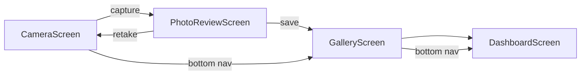

# Hiện trạng dự án / Current State

**Version:** `0.2.0+2`  
**Cập nhật cùng:** [TODO.md](../TODO.md)

Tài liệu này mô tả **code đang chạy thật** trong repo. Kiến trúc mục tiêu (TFLite, Hive, plugins đầy đủ) xem [architecture.md](architecture.md) và [diagrams/system_architecture.mmd](diagrams/system_architecture.mmd).

---

## App navigation flow



- Bottom navigation is hidden on the camera tab and during photo review.
- `PhotoReviewScreen` is a full-screen overlay, not a separate tab.

---

## Module status

| Module | Status | Key paths | Notes |
|--------|--------|-----------|-------|
| App shell | **Implemented** | `lib/app/app.dart`, `x_aesthetic_controller.dart` | 3-tab navigation, theme toggle |
| Camera | **Implemented** | `lib/presentation/camera/camera_screen.dart` | ~1700 lines; real device camera |
| HDR | **Implemented** | `lib/services/camera/software_hdr_processor.dart`, `hardware_hdr_camera_bridge.dart` | Software + Android native HDR |
| Horizon sensor | **Implemented** | `camera_screen.dart` + `sensors_plus` | Tilt indicator, calibration |
| Photo review | **Implemented** | `lib/presentation/photo_review/photo_review_screen.dart` | Active post-capture flow |
| Rule-based evaluator | **Implemented** | `lib/services/analysis/rule_based_photo_evaluator.dart` | Heuristic scoring, not ML |
| Gallery | **Implemented** | `lib/presentation/gallery/gallery_screen.dart` | Grid, delete, refresh |
| Dashboard | **Implemented** | `lib/presentation/dashboard/dashboard_screen.dart` | Stats from saved photos |
| Gallery persistence | **Implemented** | `lib/data/local/app_gallery_store.dart` | JSON + files, not Hive |
| Design system | **Implemented** | `lib/presentation/shared/x_theme.dart`, `x_widgets.dart` | Light / dark themes |
| Plugin infrastructure | **Partial** | `lib/core/plugin/*` | Contract + manager; no production plugins |
| AI pipeline | **Not started** | `lib/services/ai/ai_engine.dart` | Interface only; no TFLite |
| TFLite models | **Not started** | `assets/models/` | Directory empty (`.gitkeep`) |
| Style config loader | **Not started** | `assets/style_configs/default_styles.json` | Sample JSON exists, not loaded at runtime |
| Hive learning log | **Not started** | — | Documented in architecture only |
| Repository layer | **Not started** | `lib/domain/repositories/`, `lib/data/repositories/` | `.gitkeep` placeholders |
| Preview screen | **Legacy stub** | `lib/presentation/preview/preview_screen.dart` | Hardcoded data; not in `app.dart` |
| iOS camera permission | **Missing** | `ios/Runner/Info.plist` | No `NSCameraUsageDescription` yet |

**Legend:** Implemented = works in app · Partial = infra only · Not started = planned or interface only

---

## Actual vs target runtime path

### Current (what runs today)

```text
Camera Preview
→ inline CustomPainter overlays (grid, horizon, static placeholders)
→ Capture
→ Software / hardware HDR + aspect crop
→ RuleBasedPhotoEvaluator
→ PhotoReviewScreen
→ AppGalleryStore (JSON + image file)
→ DashboardScreen (aggregate stats)
```

### Target (north star — not fully built)

```text
Camera Preview
→ Frame Preprocessor
→ Context Detector (YOLO / TFLite)
→ PluginManager → OverlayInstruction list → CustomPainter
→ Capture
→ AttributeNet / Aesthetic Pipeline
→ Style Matcher + EMD → XAI Mapping
→ PhotoReviewScreen
→ Hive Learning Log
→ DashboardScreen
```

---

## Known gaps

1. **No production plugins** — `PluginManager` is never called from `CameraScreen`. Overlays are hardcoded painters.
2. **No live AI** — No `startImageStream` or `AiEngine.detectContext` on preview frames.
3. **Rule-based scoring only** — Post-capture analysis uses image statistics, not trained models.
4. **JSON persistence** — `AppGalleryStore` replaces planned Hive storage for now.
5. **iOS camera blocker** — Missing privacy string in `Info.plist` will prevent camera on iOS devices.
6. **Settings not persisted** — `CameraUserSettings` reset on app restart.

---

## Where to start as a new contributor

| Goal | Start here |
|------|------------|
| Run the app locally | [getting-started.md](getting-started.md) |
| See what to build next | [TODO.md](../TODO.md) |
| Understand layers | [architecture.md](architecture.md) |
| Add a guidance rule | [plugin_contract.md](plugin_contract.md) |
| Understand saved photos | [data-and-persistence.md](data-and-persistence.md) |
| Match UI to mockups | [ui-design.md](ui-design.md) |
