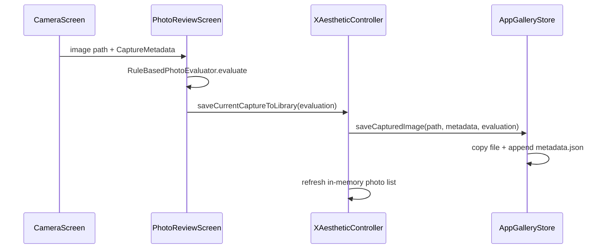

# Dữ liệu & Lưu trữ / Data and Persistence

How photos, metadata, and evaluations are stored in the current MVP. Planned Hive migration is tracked in [TODO.md](../TODO.md) Phase 4.

---

## Storage overview

| Aspect | Current implementation | Planned |
|--------|------------------------|---------|
| Engine | JSON file + image files on disk | Hive boxes |
| Class | `AppGalleryStore` | Repository + Hive adapters |
| Location | App documents directory | Same device scope |
| System gallery | Not used — app-private library | Unchanged |

**Path:** `getApplicationDocumentsDirectory()/x_aesthetic_library/`

**Files:**

```text
x_aesthetic_library/
├── metadata.json          # Array of CapturedPhoto records
├── x_aesthetic_<id>.jpg   # Copied image files
└── ...
```

---

## Save flow



---

## AppGalleryStore API

File: `lib/data/local/app_gallery_store.dart`

| Method | Description |
|--------|-------------|
| `loadPhotos()` | Parse `metadata.json`, filter missing files, sort by `createdAt` desc |
| `saveCapturedImage(sourcePath, {metadata, evaluation})` | Copy image, create `CapturedPhoto`, write JSON |
| `updatePhoto(photo)` | Replace record by `id` (e.g. after re-evaluation) |
| `deletePhoto(photo)` | Remove file + JSON entry |

---

## Data model

### CapturedPhoto

File: `lib/domain/entities/captured_photo.dart`

```json
{
  "id": "1700000000000000",
  "filePath": "/.../x_aesthetic_library/x_aesthetic_1700000000000000.jpg",
  "createdAt": "2026-06-07T10:00:00.000",
  "metadata": { ... },
  "evaluation": { ... }
}
```

### CaptureMetadata

Recorded at shutter time from `CameraUserSettings`:

| Field | Type | Example |
|-------|------|---------|
| `cameraLens` | string | `back`, `front` |
| `resolution` | string | `high`, `medium` |
| `hdrMode` | string | `off`, `light`, `strong`, `hardware` |
| `aspectRatio` | string | `ratio34`, `ratio916`, `ratio11`, `full` |
| `exposureOffset` | number | Device EV offset |
| `horizonAngle` | number | Degrees from accelerometer |
| `photoContext` | string | `auto`, `portrait`, `landscape`, … |

### PhotoEvaluation

Produced by `RuleBasedPhotoEvaluator`:

| Field | Type | Description |
|-------|------|-------------|
| `score` | number | 0–10 overall score |
| `verdict` | string | Short summary (Vietnamese) |
| `metrics` | object | Named factor scores (e.g. `light`, `contrast`) |
| `suggestions` | string[] | Actionable tips |
| `contextAnalysis` | object | Requested vs resolved `PhotoContext` |

`PhotoEvaluation.placeholder()` is used when a photo is saved before evaluation completes.

---

## Controller integration

`XAestheticController` (`lib/app/x_aesthetic_controller.dart`) wraps the store:

- `initialize()` → `refreshLibrary()`
- `saveCurrentCaptureToLibrary({evaluation})` → persists and updates `_photos`
- `updatePhotoEvaluation(photo, evaluation)` → re-score saved photo
- `deletePhoto(photo)` → store delete + list refresh

Presentation screens (`GalleryScreen`, `DashboardScreen`, `PhotoReviewScreen`) read state via `XAestheticScope` / `XScopeBuilder`.

---

## What is not persisted

| Data | Behavior |
|------|----------|
| `CameraUserSettings` | In-memory only — resets on restart (Phase 4 task) |
| Plugin registry | Built at runtime when implemented |
| Style configs | `default_styles.json` not loaded yet (Phase 9 task) |

---

## Planned: Hive learning log

Target architecture stores time-series learning events in Hive for dashboard trends and offline analytics. Migration path:

1. Define Hive adapters for `CapturedPhoto` / learning events.
2. Implement repository interfaces in `lib/domain/repositories/`.
3. Migrate `AppGalleryStore` read/write to Hive backend.
4. Keep JSON export optional for debugging.

See [architecture.md](architecture.md) target runtime flow and [TODO.md](../TODO.md) Phase 4.
