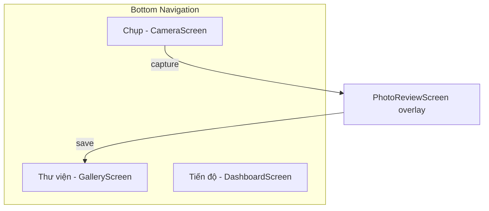

# UI & Design / Giao diện

Index of design mockups and their mapping to Flutter screens. Theme tokens live in `lib/presentation/shared/x_theme.dart`.

---

## Mockup index

| Mockup | Screen | Path | Implementation status |
|--------|--------|------|----------------------|
| `camera_guidance_mockup.png` | Camera | `lib/presentation/camera/camera_screen.dart` | Grid + horizon done; AI guidance overlays pending |
| `post_capture_analysis_mockup.png` | Photo Review | `lib/presentation/photo_review/photo_review_screen.dart` | Rule-based analysis UI; ML pipeline pending |
| `progress_dashboard_mockup.png` | Dashboard | `lib/presentation/dashboard/dashboard_screen.dart` | Real stats from saved photos |
| `x_aesthetic_light_flow.png` | App-wide | `lib/presentation/shared/x_theme.dart` | Light theme tokens |
| `x_aesthetic_dark_flow.png` | App-wide | `lib/presentation/shared/x_theme.dart` | Dark theme tokens |

All mockups are in [`docs/ui_mockups/`](ui_mockups/).

---

## Screen map

| Tab label (VI) | Widget | Nav visible |
|----------------|--------|-------------|
| Chụp | `CameraScreen` | Hidden — full-screen camera UX |
| Thư viện | `GalleryScreen` | Visible |
| Tiến độ | `DashboardScreen` | Visible |

`PhotoReviewScreen` overlays the shell after capture. Bottom nav is hidden during review.

---

## Design system

### Theme

- `XAestheticTheme.lightTheme` / `darkTheme` — Material 3 base
- `context.x` extension — semantic tokens: `primary`, `surface`, `muted`, `border`, `shadow`, etc.
- Theme mode toggled via `CameraUserSettings.themeMode` in camera settings sheet

### Shared widgets (`x_widgets.dart`)

| Widget | Used in |
|--------|---------|
| `XBackground` | Gallery, Dashboard, Review |
| `XCard` | Score cards, factor grids |
| `EmptyState` | Empty gallery |
| `PhotoThumbnail` | Gallery grid, dashboard strip |
| `XAestheticBottomNav` | `app.dart` shell |
| `XScopeBuilder` | Screens reading `XAestheticController` |

---

## Camera UI components

Implemented in `camera_screen.dart`:

| UI element | Type | Notes |
|------------|------|-------|
| Rule-of-thirds grid | `CustomPainter` | Settings-toggleable |
| Horizon tilt indicator | Sensor-driven widget | Calibration button |
| Aspect ratio frame | Preview mask + crop | 3:4, 9:16, 1:1, full |
| Exposure slider | Settings sheet | Device min/max offsets |
| HDR mode chips | Settings sheet | Off / Light / Strong / HDR+ |
| Photo context chips | Settings sheet | Affects evaluator weights |
| Subject outline | Static painted rect | Placeholder — not AI-driven |
| Suggestion frame | Dashed static frame | Placeholder — not plugin-driven |

---

## Localization

UI copy is **Vietnamese** across main screens (Chụp, Thư viện, Tiến độ, review verdicts, suggestions). Technical docs remain bilingual or English per file convention.

---

## Legacy screen

`lib/presentation/preview/preview_screen.dart` — early stub with hardcoded score `7.2`. **Not wired** into `app.dart`. Post-capture flow uses `PhotoReviewScreen` instead. Scheduled for retirement (TODO Phase 3 / 6).
